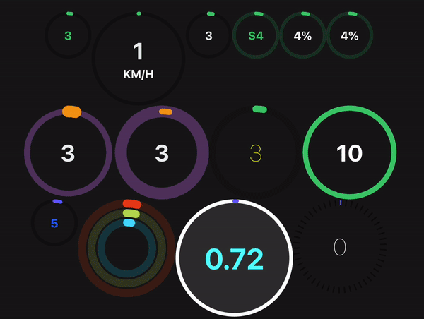
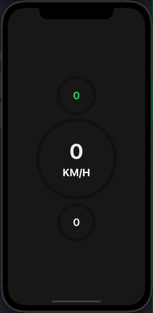
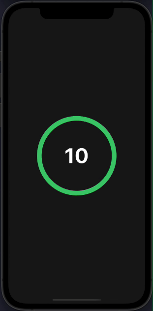
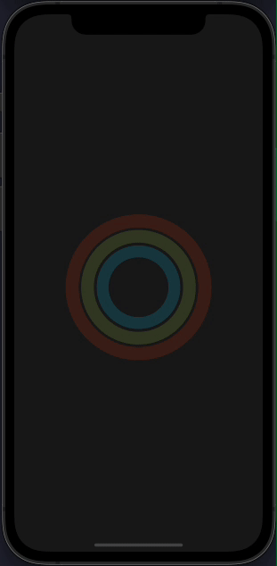
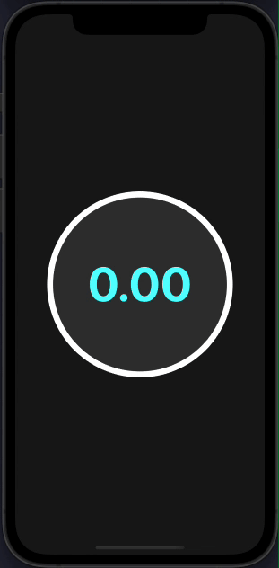
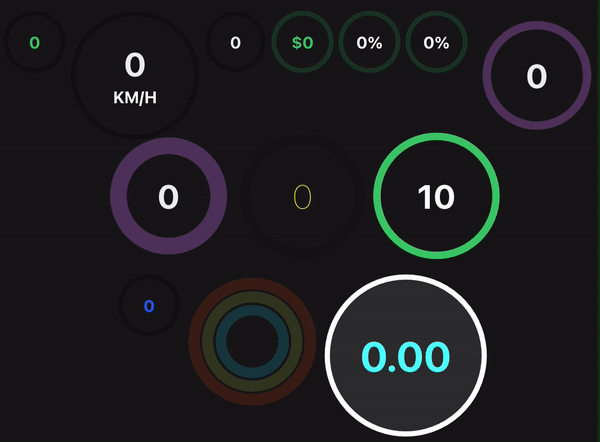
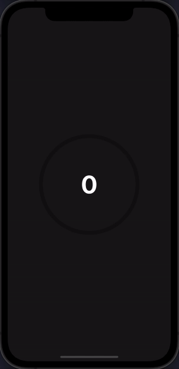
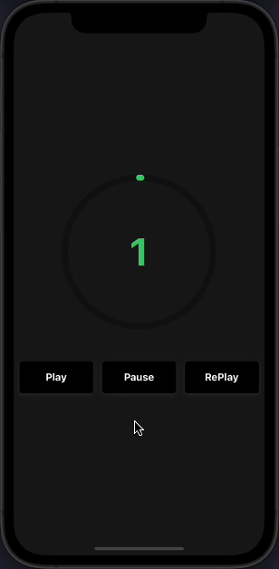

#  React Native Circular Progress Indicator 🔥

[]()

[](https://www.npmjs.com/package/react-native-circular-progress-indicator)
[](https://www.npmjs.com/package/react-native-circular-progress-indicator)

A simple and customizable React Native circular progress indicator component. 

This project is inspired from this [Youtube tutorial](https://www.youtube.com/watch?v=x2LtzCxbWI0). Do check it out. Special mention at [@mironcatalin](https://www.youtube.com/channel/UCTcH04SRuyedaSuuQVeAcdg)

## Demo
## ❤️ [Try on Expo Snack](https://snack.expo.dev/@nithinpp69/react-native-circular-progress-indicator/?platform=ios)













## Prerequisites

 ⚠️ Peer Dependencies

 * [react-native-svg](https://www.npmjs.com/package/react-native-svg#installation)
 * [react-native-reanimated-v2](https://docs.swmansion.com/react-native-reanimated/docs/fundamentals/installation/)

This component has a peer dependency on react-native-reanimated-v2. react-native-reanimated-v2 has to be installed and linked into your project.
Follow [react-native-reanimated-v2](https://docs.swmansion.com/react-native-reanimated/docs/fundamentals/installation/) to install the dependency.

This component has a peer dependency on react-native-svg to draw the countdown circle. react-native-svg has to be installed and linked into your project.
Follow [react-native-svg](https://www.npmjs.com/package/react-native-svg#installation) to install the dependency.

This library also depends on `withPause` function from `react-native-redash`. If you have already installed `react-native-redash`, make sure the package
version is at-least `v15.0.1`

## Installation

 Supported version: react-native >= 0.59.0

  ```bash
  npm install react-native-circular-progress-indicator
  ```
  
  or
  
  ```bash
  yarn add react-native-circular-progress-indicator
  ```
  
## Example
```jsx
import CircularProgress from 'react-native-circular-progress-indicator';

....

<CircularProgress value={58} />
<CircularProgress
  value={60}
  radius={120}
  duration={2000}
  progressValueColor={'#ecf0f1'}
  maxValue={200}
  title={'KM/H'}
  titleColor={'white'}
  titleStyle={{fontWeight: 'bold'}}
/>
<CircularProgress
  value={60}
  activeStrokeWidth={12}
  progressValueColor={'#ecf0f1'}
/>

```


#### With value prefix/suffix

```jsx
import CircularProgress from 'react-native-circular-progress-indicator';

....

<CircularProgress
  value={90}
  valuePrefix={'$'}
  inActiveStrokeColor={'#2ecc71'}
  inActiveStrokeOpacity={0.2}
/>

<CircularProgress
  value={85}
  inActiveStrokeColor={'#2ecc71'}
  inActiveStrokeOpacity={0.2}
  progressValueColor={'#fff'}
  valueSuffix={'%'}
/>

```


#### With callback function

```jsx
import CircularProgress from 'react-native-circular-progress-indicator';

....

<CircularProgress
  value={90}
  inActiveStrokeColor={'#2ecc71'}
  inActiveStrokeOpacity={0.2}
  progressValueColor={'#fff'}
  valueSuffix={'%'}
  onAnimationComplete={() => { alert('callback') }}
/>

```


#### Custom

```jsx
import CircularProgress from 'react-native-circular-progress-indicator';

....

 <CircularProgress
  value={60}
  radius={120}
  progressValueColor={'#ecf0f1'}
  activeStrokeColor={'#f39c12'}
  inActiveStrokeColor={'#9b59b6'}
  inActiveStrokeOpacity={0.5}
  inActiveStrokeWidth={20}
  activeStrokeWidth={40}
/>
       
<CircularProgress
  value={60}
  radius={120}
  progressValueColor={'#ecf0f1'}
  activeStrokeColor={'#f39c12'}
  inActiveStrokeColor={'#9b59b6'}
  inActiveStrokeOpacity={0.5}
  inActiveStrokeWidth={40}
  activeStrokeWidth={20}
/>

<CircularProgress
  value={60}
  radius={120}
  inActiveStrokeOpacity={0.5}
  activeStrokeWidth={20}
  inActiveStrokeWidth={20}
  progressValueStyle={{ fontWeight: '100', color: 'yellow' }}
/>

```


#### Use as a countdown timer

```jsx
import CircularProgress from 'react-native-circular-progress-indicator';

....

<CircularProgress
  value={0}
  radius={120}
  maxValue={10}
  initialValue={10}
  progressValueColor={'#fff'}
  activeStrokeWidth={15}
  inActiveStrokeWidth={15}
  duration={10000}
  onAnimationComplete={() => alert('time out')}
/>

```


#### With gradient effect

```jsx
import CircularProgress from 'react-native-circular-progress-indicator';

....

<CircularProgress
  value={100}
  activeStrokeColor={'#2465FD'}
  activeStrokeSecondaryColor={'#C25AFF'}
/>

```


#### With multiple child

⚠️ IMPORTANT ⚠️
CircularProgressWithChild component has been renamed to CircularProgressBase. The CircularProgressWithChild component is still available in the package but will be removed in the
next releases Please use the new CircularProgressBase component instead.

```jsx
import { CircularProgressBase } from 'react-native-circular-progress-indicator';

// accepts any react element as child
....

const props = {
  activeStrokeWidth: 25,
  inActiveStrokeWidth: 25,
  inActiveStrokeOpacity: 0.2
};

...

<CircularProgressBase
  {...props}
  value={80}
  radius={125}
  activeStrokeColor={'#e84118'}
  inActiveStrokeColor={'#e84118'}
>
  <CircularProgressBase
    {...props}
    value={87}
    radius={100}
    activeStrokeColor={'#badc58'}
    inActiveStrokeColor={'#badc58'}
  >
    <CircularProgressBase
      {...props}
      value={62}
      radius={75}
      activeStrokeColor={'#18dcff'}
      inActiveStrokeColor={'#18dcff'}
    />
  </CircularProgressBase>
</CircularProgressBase>

```


#### Custom progress formatter function

By default, the progress value is rounded to the nearest integer. If you want to display decimal place values, you can do so by,

```jsx
import CircularProgress from 'react-native-circular-progress-indicator';

....

<CircularProgress
  value={30}
  radius={150}
  duration={1000}
  progressValueColor={'cyan'}
  titleFontSize={16}
  titleColor={'#333'}
  titleStyle={{ fontWeight: 'bold' }}
  circleBackgroundColor={'#333'}
  activeStrokeColor={'#2465FD'}
  activeStrokeSecondaryColor={'#C3305D'}
  inActiveStrokeColor={'white'}
  progressFormatter={(value: number) => {
    'worklet';
      
    return value.toFixed(2); // 2 decimal places
  }}
/>
```

Make sure to mark this function as a worklet function. Read more about worklets at https://docs.swmansion.com/react-native-reanimated/docs/2.2.0/worklets/


#### Dashed circular progress

```jsx
import CircularProgress from 'react-native-circular-progress-indicator';

....

<CircularProgress
  value={97}
  radius={120}
  inActiveStrokeOpacity={0.5}
  activeStrokeWidth={15}
  inActiveStrokeWidth={20}
  progressValueStyle={{ fontWeight: '100', color: 'white' }}
  activeStrokeSecondaryColor="yellow"
  inActiveStrokeColor="black"
  duration={5000}
  dashedStrokeConfig={{
    count: 50,
    width: 4,
  }}
/>
```


#### Animated stroke color

```jsx
import CircularProgress from 'react-native-circular-progress-indicator';

....

 <CircularProgress
  value={100}
  radius={120}
  progressValueColor={'#fff'}
  duration={10000}
  strokeColorConfig={[
    { color: 'red', value: 0 },
    { color: 'skyblue', value: 50 },
    { color: 'yellowgreen', value: 100 },
  ]}
/>
```

#### Play, Pause, and ReAnimate

```jsx
import CircularProgress, { ProgressRef } from 'react-native-circular-progress-indicator';

const progressRef = useRef<ProgressRef>(null);

// to pause animation
progressRef.current.pause();

// to play animation
progressRef.current.play();

// to re-play animation
progressRef.current.reAnimate();

....

 <CircularProgress
  ref={progressRef}
  value={100}
  radius={120}
  duration={10000}
/>
```


## Props

## CircularProgressBase Props

| Prop                        | Description                                                                           | Type                          | Default Value       | Required |
| :--------------------------:|:--------------------------------------------------------------------------------------|:-----------------------------:|:-------------------:|:--------:|
| value                       | progress value                                                                        | Number                        | 0                   | true     |
| initialValue                | initial progress value. Helpful when used as a countdown timer                        | Number                        | 0                   | false    |
| circleBackgroundColor       | progress circle background color                                                      | String                        | 'transparent'       | false    |
| radius                      | progress circle radius                                                                | Number                        | 60                  | false    |
| activeStrokeWidth           | active progress circle stroke width                                                   | Number                        | 10                  | false    |
| inActiveStrokeWidth         | inactive progress circle stroke width                                                 | Number                        | 10                  | false    |
| duration                    | progress animation duration                                                           | Number                        | 500                 | false    |
| delay                       | progress animation delay                                                              | Number                        | 0                   | false    |
| maxValue                    | progress maximum value. Percentage calculation is based on the maximum value provided | String                        | 100                 | false    |
| inActiveStrokeOpacity       | inactive progress circle opacity value                                                | Number                        | 1                   | false    |
| rotation                    | rotate the progress ring by this value. Accepts a number from -360 to 360             | Number                        | 0                   | false    |
| strokeLinecap               | progress stroke line cap                                                              | 'round' or 'butt' or 'square' | 'round'             | false    |
| onAnimationComplete         | callback when animation is completed.                                                 | Function                      | ()=>null            | false    |
| activeStrokeColor           | active progress circle color                                                          | String                        | '#2ecc71'         | false    |
| activeStrokeSecondaryColor  | active progress secondary color. Use this to provide a gradient effect                | String                        | ''                  | false    |
| inActiveStrokeColor         | inactive progress circle color                                                        | String                        | 'rgba(0,0,0,0.3)' | false    |
| clockwise                   | show ring progress clockwise or anti-clockwise. pass false to enable anti clock-wise  | Bool                          | true                | false    |
| dashedStrokeConfig          | display the progress circle as dashed lines with customizable stroke count and width. | DashedStrokeConfigType        | { width: 0, count: 0 }| false  |
| strokeColorConfig           | animate the progress circle stroke color based on the animation value.                | StrokeColorConfigType[]       | undefined           | false    |
| startInPausedState          | render the progress circle initially without any animation.                            | Bool                          | false               | false    |
| children                    | any react element                                                                     | React Element                 | null                | false    |                                
                                
## CircularProgress Props

CircularProgress component accepts all CircularProgressBase props except the children prop. Along with that, it also accepts the following props.

| Prop                        | Description                                                                           | Type                          | Default Value       | Required |
| :--------------------------:|:--------------------------------------------------------------------------------------|:-----------------------------:|:-------------------:|:--------:|
| title                       | title to display below the progress value                                             | String                        | ''                  | false    |
| titleStyle                  | title text style                                                                      | Object                        | {}                  | false    |
| titleColor                  | title text color                                                                      | String                        |                     | false    |
| titleFontSize               | title text font size                                                                  | Number                        |                     | false    |
| subtitle                    | subtitle to display below the progress value                                          | String                        | ''                  | false    |
| subtitleStyle               | subtitle text style                                                                   | Object                        | {}                  | false    |
| subtitleColor               | subtitle text color                                                                   | String                        |                     | false    |
| subtitleFontSize            | subtitle text font size                                                               | Number                        |                     | false    |
| progressValueColor          | progress value text color                                                             | String                        |                     | false    |
| progressValueStyle          | progress value text style                                                             | Object                        | {}                  | false    |
| progressValueFontSize       | progress value text font size                                                         | Number                        |                     | false    |
| inActiveStrokeOpacity       | inactive progress circle opacity value                                                | Number                        | 1                   | false    |
| valuePrefix                 | prefix value                                                                          | String                        | ''                  | false    |
| valueSuffix                 | suffix value                                                                          | String                        | ''                  | false    |
| showProgressValue           | show or hide the progress text value                                                  | Bool                          | true                | false    |
| progressFormatter           | function to format the progress value. Make sure to define it as a worklet function.  | Function                      | (v)=> Math.round(v) | false    |
| allowFontScaling            | specifies whether fonts should scale to respect Text Size accessibility settings.     | Bool                          | true                | false    |
| valuePrefixStyle            | custom styling to value prefix. Use this to customize the styling of the value prefix. If not provided, the progress value style/colors will be used. | TextStyle | {} | false |
| valueSuffixStyle            | custom styling to value suffix. Use this to customize the styling of the value suffix. If not provided, the progress value style/colors will be used. | TextStyle | {} | false |

## Methods

`pause`
Imperative method to pause the animation.

```javascript
progressRef.current.pause();
```

`play`
Imperative method to play the animation once paused.

```javascript
progressRef.current.play();
```

`reAnimate`
Imperative method to restart the animation.

```javascript
progressRef.current.reAnimate();
```

## License
This project is licensed under the MIT License.
