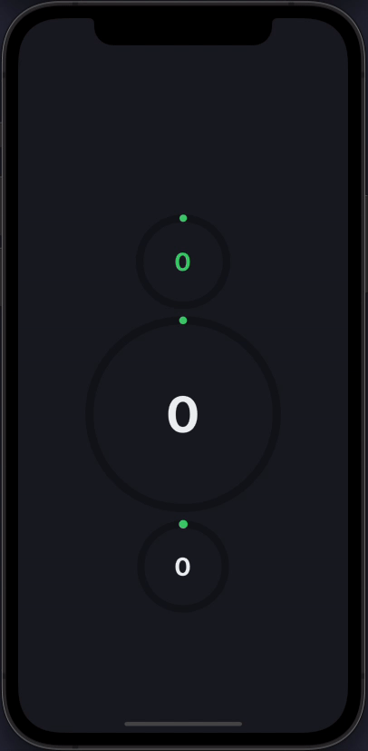
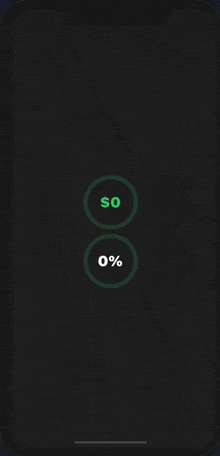
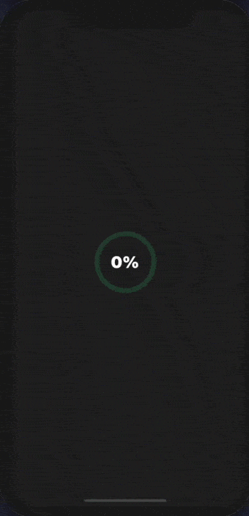
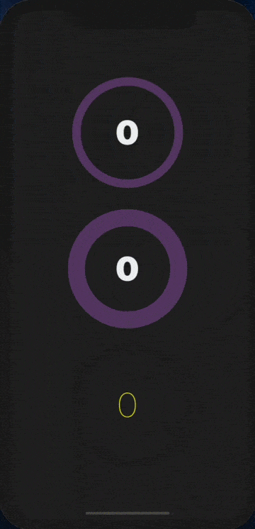
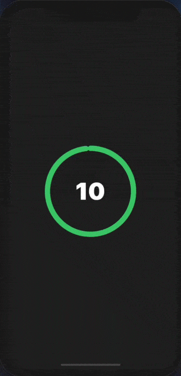
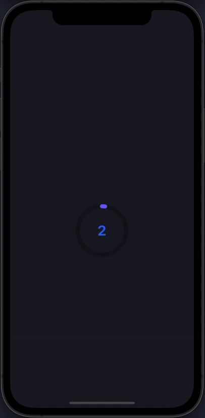

# react-native-circular-progress-indicator

[]()

[](https://www.npmjs.com/package/react-native-circular-progress-indicator)
[](https://www.npmjs.com/package/react-native-circular-progress-indicator)

A simple and customizable React Native circular progress indicator component. 

This project is inspired from this [Youtube tutorial](https://www.youtube.com/watch?v=x2LtzCxbWI0). Do check it out. Special mention at [@mironcatalin](https://www.youtube.com/channel/UCTcH04SRuyedaSuuQVeAcdg)
## Demo

❤️ [Expo Snack](https://snack.expo.dev/@nithinpp69/react-native-circular-progress-indicator)









## Prerequisites

 ⚠️ Peer Dependencies

 * [react-native-svg](https://www.npmjs.com/package/react-native-svg#installation)
 * [react-native-reanimated-v2](https://docs.swmansion.com/react-native-reanimated/docs/fundamentals/installation/)

This component has a peer dependency on react-native-reanimated-v2. react-native-reanimated-v2 has to be installed and linked into your project.
Follow [react-native-reanimated-v2](https://docs.swmansion.com/react-native-reanimated/docs/fundamentals/installation/) to install the dependency.

This component has a peer dependency on react-native-svg to draw the countdown circle. react-native-svg has to be installed and linked into your project.
Follow [react-native-svg](https://www.npmjs.com/package/react-native-svg#installation) to install the dependency.

## Installation

 Supported version: react-native >= 0.59.0

  ```
  npm install react-native-circular-progress-indicator
  ```
  
  or
  
  ```
  yarn add react-native-circular-progress-indicator
  ```
  
## Example
```
import CircularProgress from 'react-native-circular-progress-indicator';

....

<CircularProgress value={58} />
<CircularProgress
  value={60}
  radius={120}
  duration={2000}
  textColor={'#ecf0f1'}
  maxValue={200}
  title={'KM/H'}
  titleColor={'white'}
  titleStyle={{fontWeight: 'bold'}}
/>
<CircularProgress
  value={60}
  activeStrokeWidth={12}
  textColor={'#ecf0f1'}
/>

```


#### with value prefix/suffix

```
import CircularProgress from 'react-native-circular-progress-indicator';

....

<CircularProgress
  value={90}
  valuePrefix={'$'}
  inActiveStrokeColor={'#2ecc71'}
  inActiveStrokeOpacity={0.2}
/>

<CircularProgress
  value={85}
  inActiveStrokeColor={'#2ecc71'}
  inActiveStrokeOpacity={0.2}
  textColor={'#fff'}
  valueSuffix={'%'}
/>

```


#### with callback function

```
import CircularProgress from 'react-native-circular-progress-indicator';

....

<CircularProgress
  value={90}
  inActiveStrokeColor={'#2ecc71'}
  inActiveStrokeOpacity={0.2}
  textColor={'#fff'}
  valueSuffix={'%'}
  onAnimationComplete={() => { alert('callback') }}
/>

```


#### custom

```
import CircularProgress from 'react-native-circular-progress-indicator';

....

 <CircularProgress
  value={60}
  radius={120}
  textColor={'#ecf0f1'}
  activeStrokeColor={'#f39c12'}
  inActiveStrokeColor={'#9b59b6'}
  inActiveStrokeOpacity={0.5}
  inActiveStrokeWidth={20}
  activeStrokeWidth={40}
/>
       
<CircularProgress
  value={60}
  radius={120}
  textColor={'#ecf0f1'}
  activeStrokeColor={'#f39c12'}
  inActiveStrokeColor={'#9b59b6'}
  inActiveStrokeOpacity={0.5}
  inActiveStrokeWidth={40}
  activeStrokeWidth={20}
/>

<CircularProgress
  value={60}
  radius={120}
  inActiveStrokeOpacity={0.5}
  activeStrokeWidth={20}
  inActiveStrokeWidth={20}
  textStyle={{ fontWeight: '100', color: 'yellow' }}
/>

```


#### use as a countdown timer

```
import CircularProgress from 'react-native-circular-progress-indicator';

....

<CircularProgress
  value={0}
  radius={120}
  maxValue={10}
  initialValue={10}
  textColor={'#fff'}
  activeStrokeWidth={15}
  inActiveStrokeWidth={15}
  duration={10000}
  onAnimationComplete={() => alert('time out')}
/>

```


#### with gradient effect

```
import CircularProgress from 'react-native-circular-progress-indicator';

....

<CircularProgress
  value={100}
  activeStrokeColor={'#2465FD'}
  activeStrokeSecondaryColor={'#C25AFF'}
/>

```


#### with multiple child
```
import { CircularProgressWithChild } from 'react-native-circular-progress-indicator';

// accepts any react element as child
....

const props = {
  activeStrokeWidth: 25,
  inActiveStrokeWidth: 25,
  inActiveStrokeOpacity: 0.2
};

...

<CircularProgressWithChild
  {...props}
  value={80}
  radius={125}
  activeStrokeColor={'#e84118'}
  inActiveStrokeColor={'#e84118'}
>
  <CircularProgressWithChild
    {...props}
    value={87}
    radius={100}
    activeStrokeColor={'#badc58'}
    inActiveStrokeColor={'#badc58'}
  >
    <CircularProgressWithChild
      {...props}
      value={62}
      radius={75}
      activeStrokeColor={'#18dcff'}
      inActiveStrokeColor={'#18dcff'}
    />
  </CircularProgressWithChild>
</CircularProgressWithChild>

```


## Props
| Prop                        | Description                                                                           | Type                          | Default Value       | Required |
| :--------------------------:|:--------------------------------------------------------------------------------------|:-----------------------------:|:-------------------:|:--------:|
| value                       | progress value                                                                        | Number                        | 0                   | true     |
| initialValue                | initial progress value. Helpful when used as a countdown timer                        | Number                        | 0                   | false    |
| title                       | title to display below the progress value                                             | String                        | ''                  | false    |
| titleStyle                  | title text style                                                                      | Object                        | {}                  | false    |
| titleColor                  | title text color                                                                      | String                        |                     | false    |
| titleFontSize               | title text font size                                                                  | Number                        |                     | false    |
| subtitle                    | subtitle to display below the progress value                                          | String                        | ''                  | false    |
| subtitleStyle               | subtitle text style                                                                   | Object                        | {}                  | false    |
| subtitleColor               | subtitle text color                                                                   | String                        |                     | false    |
| subtitleFontSize            | subtitle text font size                                                               | Number                        |                     | false    |
| circleBackgroundColor       | progress circle background color                                                      | String                        | 'transparent'       | false    |
| radius                      | progress circle radius                                                                | Number                        | 60                  | false    |
| activeStrokeWidth           | active progress circle stroke width                                                   | Number                        | 10                  | false    |
| inActiveStrokeWidth         | inactive progress circle stroke width                                                 | Number                        | 10                  | false    |
| duration                    | progress animation duration                                                           | Number                        | 500                 | false    |
| delay                       | progress animation delay                                                              | Number                        | 0                   | false    |
| textColor                   | progress value text color                                                             | String                        |                     | false    |
| textStyle                   | progress value text style                                                             | Object                        | {}                  | false    |
| maxValue                    | progress maximum value. Percentage calculation is based on the maximum value provided | String                        | 100                 | false    |
| fontSize                    | progress value text font size                                                         | Number                        |                     | false    |
| inActiveStrokeOpacity       | inactive progress circle opacity value                                                | Number                        | 1                   | false    |
| strokeLinecap               | progress stroke line cap                                                              | 'round' or 'butt' or 'square' | 'round'             | false    |
| onAnimationComplete         | callback when animation is completed.                                                 | Function                      | ()=>{}              | false    |
| valuePrefix                 | prefix value                                                                          | String                        | ''                  | false    |
| valueSuffix                 | suffix value                                                                          | String                        | ''                  | false    |
| activeStrokeColor           | active progress circle color                                                          | String                        | '#2ecc71'         | false    |
| activeStrokeSecondaryColor  | active progress secondary color. Use this to provide a gradient effect                | String                        | ''                  | false    |
| inActiveStrokeColor         | inactive progress circle color                                                        | String                        | 'rgba(0,0,0,0.3)' | false    |
| showProgressValue           | show or hide the progress text value                                                  | Bool                          | true                | false    |
| clockwise                   | show ring progress clockwise or anti-clockwise. pass false to enable anti clock-wise  | Bool                          | true                |  false    |

## License
This project is licenced under the MIT License.
